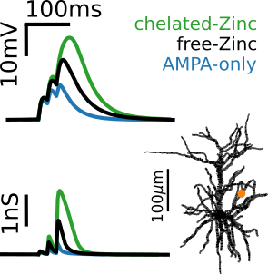

<div></div>

## Modeling Zinc modulation of NMDAR signaling in neocortical neurons

> Source code for the theoretical model in the paper:

> "Activity-dependent modulation of NMDA receptors by endogenous zinc shapes dendritic function in cortical neurons".

> A Morabito, Y Zerlaut, B Serraz, R Sala, P Paoletti, N Rebola. Cell Reports (2022)


[BioRXiv version of the paper](https://www.biorxiv.org/content/10.1101/2021.09.17.460586v1)

## Results and implementation

- we derive a model for the Zinc modulation of NMDAR that we implement in a morphologically-detailed reconstruction of a mouse layer 2/3 pyramidal cell --> see [description notebook](./description.ipynb)
- we study the role of zinc in the NMDAR-mediated response to synaptic stimulation --> see notebook [NMDA-spike](NMDA-spike.ipynb)
- we study multi-input integration in the model --> see notebook [Multi-Input-Integration](Multi-Input-Integration.ipynb)
- we analyze the import of *in-vivo*-like ongoing dynamics on the modulation of Zinc --> see notebooks [Sensitivity_to_Background_Modulation](./Sensitivity_to_Background_Modulation.ipynb) and [Figure 5](./Figure5.ipynb).

## Software requirements / Installation

- A `python` distribution for scientific computing (e.g. Anaconda) with the classical modules for scientific analysis.

- `brian2`: a simulator of single cell and network dynamics, see the [Brian2 documentation](https://brian2.readthedocs.io/en/stable/), get it with `pip install brian2`.

*Installation commands (from the [Anaconda prompt](https://docs.anaconda.com/anaconda/user-guide/getting-started/#write-a-python-program-using-anaconda-prompt-or-terminal))*
```
pip install numpy scipy matplotlib argparse brian2 # required dependencies (see above) if not already installed !
git clone https://github.com/yzerlaut/zinc-NMDA-modulation
cd zinc-NMDA-modulation
git submodule init
git submodule update
```

## Cellular morphology dataset

We make use of the publicly available dataset of cellular morphologies taken from the following study:

Jiang et al., _Science_ (2015): Principles of connectivity among morphologically defined cell types in adult neocortex https://science.sciencemag.org/content/350/6264/aac9462

## Model capabilities

### Branco et al., *Neuron* 2011

As a starting point for this investigation, we reproduced Figure 5 of [Branco et al. (2011)](https://www.sciencedirect.com/science/article/pii/S0896627311001036) in our model with the considered morphology:


See the [branco-et-al-2011.py](./branco-et-al-2011.py) script for the implementation.

## Getting help

In case of questions, you can email: yann [dot] zerlaut [at] gmail [dot] com.

If you find a bug, please open a ticket in the [issue tracker](https://github.com/yzerlaut/zinc-NMDA-modulation/issues).

## Acknowledgments

<div></div>

This open source software code was developed thanks to the funding from the [Fondation pour la Recherche Médicale](https://www.frm.org/) under the fellowship agreement ARF201909009117.

