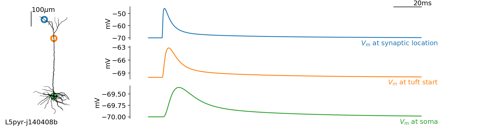
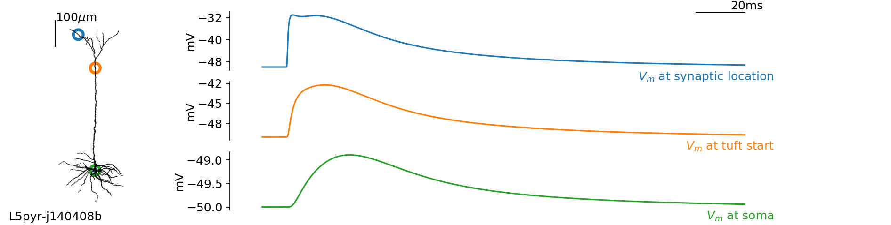

# Zinc modulation of NMDA-dependent synaptic transmission in neocortical neurons

Source code for the analysis of zinc modulation of NMDA-dependent synaptic transmission in neocortical neurons. Implementing stochastic synaptic activity emulating _in-vivo_-like ongoing dynamics in neocortical networks 

## Requirements

- =python= (use a python distribution for scientific computing, e.g. Anaconda)

- =brian2=: a simulator of single cell computation and network dynamics, get it with `pip install brian2`

## Cellular morphology dataset

We make use of the publicly available dataset of cellular morphologies taken from the following study:

Jiang et al., _Science_ (2015): Principles of connectivity among morphologically defined cell types in adult neocortex !(https://science.sciencemag.org/content/350/6264/aac9462)[https://science.sciencemag.org/content/350/6264/aac9462]

## cellular biophysics: implementation

```
##########################################################
# -- EQUATIONS FOR THE SYNAPTIC AND CELLULAR BIOPHYSICS --
##########################################################
# cable theory:
eqs='''
Im = gL * (EL - v) : amp/meter**2
Is = gE * (Ee - v) + gI * (Ei - v) : amp (point current)
gE : siemens
gI : siemens
'''
# synaptic dynamics:
# -- excitation (NMDA-dependent)
EXC_SYNAPSES_EQUATIONS = '''dgAMPA/dt = -gAMPA/tauAMPA : siemens (clock-driven)
                           dgRiseNMDA/dt = -gRiseNMDA/tauRiseNMDA : 1 (clock-driven)
                           dgDecayNMDA/dt = -gDecayNMDA/tauDecayNMDA : 1 (clock-driven)
                           gE_post = gAMPA+wNMDA*ANMDA*(gDecayNMDA-gRiseNMDA)/(1+0.3*exp(-v/V0NMDA)) : siemens (summed)''' 
ON_EXC_EVENT = 'gAMPA += wAMPA; gDecayNMDA += 1; gRiseNMDA += 1'
# -- inhibition (NMDA-dependent)
INH_SYNAPSES_EQUATIONS = '''dgGABA/dt = -gGABA/tauGABA : siemens (clock-driven)
                            gI_post = gGABA : siemens (summed)''' 
ON_INH_EVENT = 'gGABA += wGABA'
```

## NMDA-dependent excitatory synaptic transmission

Post-synaptic potentials at -70mV (5 synchronous synaptic events):



Post-synaptic potentials at -50mV (5 synchronous synaptic events):



## Background synaptic activity

contributor:  yann.zerlaut@cnrs.fr
