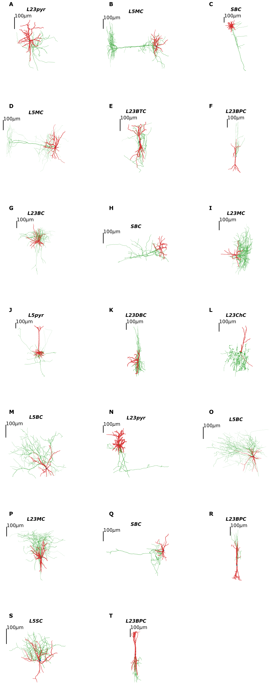
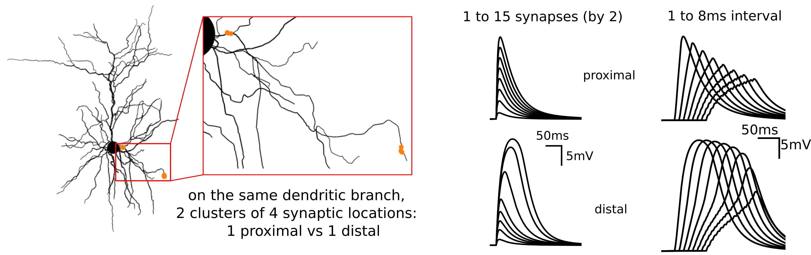
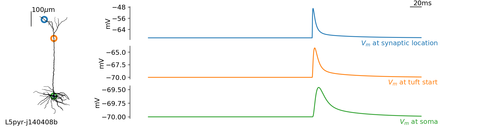
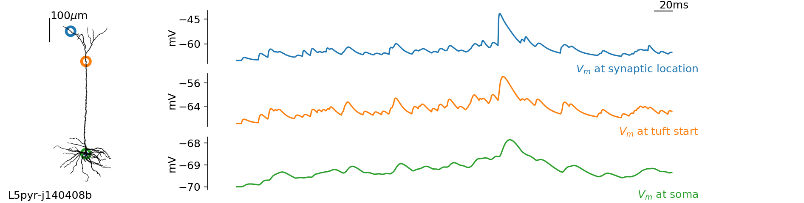
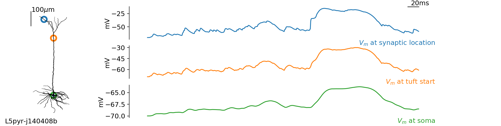
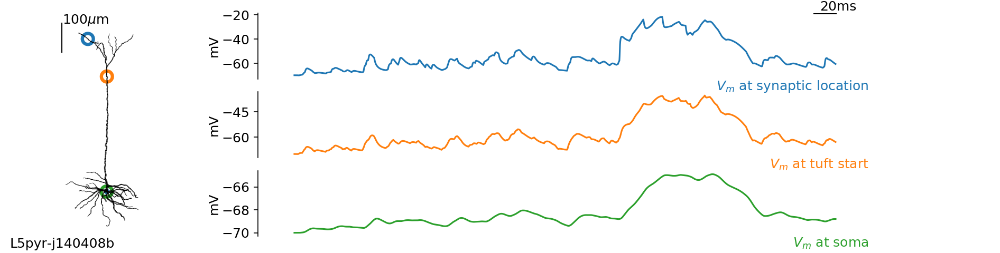
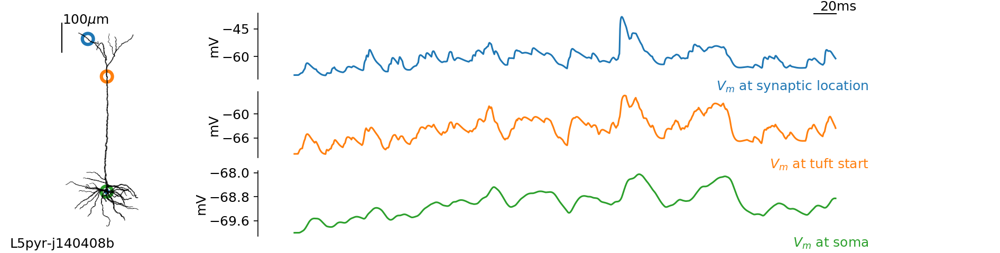

# Theoretical analysis of the Zinc-mediated modulation of NMDA-dependent synaptic transmission in neocortical neurons: modeling and impact on cellular computation

Source code for the theoretical model of zinc modulation of NMDA-dependent synaptic transmission in neocortical neurons. Implementing stochastic synaptic activity emulating _in-vivo_-like ongoing dynamics in neocortical networks. Analyzing the impact on cellular computation under 

## Requirements

- `python` (use a python distribution for scientific computing, e.g. Anaconda)

- `brian2`: a simulator of single cell computation and network dynamics, get it with `pip install brian2`

## Cellular morphology dataset

We make use of the publicly available dataset of cellular morphologies taken from the following study:

Jiang et al., _Science_ (2015): Principles of connectivity among morphologically defined cell types in adult neocortex https://science.sciencemag.org/content/350/6264/aac9462

<!-- Set of morphologies (dendritic arborization in red, axonal projections in green): -->
<!--  -->

## Model capabilities

### - Branco et al., *Neuron* 2011

Trying to reproduce Figure 5 of [Branco et al. (2011)](https://www.sciencedirect.com/science/article/pii/S0896627311001036) in our model with the considered morphology:




## cellular biophysics: implementation

Analogous to Farinella et al. _PLoS Comp Biol_:

```
##########################################################
# -- EQUATIONS FOR THE SYNAPTIC AND CELLULAR BIOPHYSICS --
##########################################################
# cable theory:
eqs='''
Im = gL * (EL - v) : amp/meter**2
Is = gE * (Ee - v) + gI * (Ei - v) : amp (point current)
gE : siemens
gI : siemens
'''
# synaptic dynamics:
# -- excitation (NMDA-dependent)
EXC_SYNAPSES_EQUATIONS = '''dgAMPA/dt = -gAMPA/tauAMPA : siemens (clock-driven)
                           dgRiseNMDA/dt = -gRiseNMDA/tauRiseNMDA : 1 (clock-driven)
                           dgDecayNMDA/dt = -gDecayNMDA/tauDecayNMDA : 1 (clock-driven)
                           gE_post = gAMPA+wNMDA*ANMDA*(gDecayNMDA-gRiseNMDA)/(1+0.3*exp(-v/V0NMDA)) : siemens (summed)''' 
ON_EXC_EVENT = 'gAMPA += wAMPA; gDecayNMDA += 1; gRiseNMDA += 1'
# -- inhibition (NMDA-dependent)
INH_SYNAPSES_EQUATIONS = '''dgGABA/dt = -gGABA/tauGABA : siemens (clock-driven)
                            gI_post = gGABA : siemens (summed)''' 
ON_INH_EVENT = 'gGABA += wGABA'
```

## NMDA-dependent excitatory synaptic transmission

Post-synaptic potentials at -70mV (5 synchronous synaptic events):


Post-synaptic potentials at -50mV (5 synchronous synaptic events):


## Background synaptic activity

Adding stochastic background synaptic activity on top of the evoked (synchronous) synaptic event(s):

N.B. We restrict the synaptic activity to the apical tuft.

No background:



With excitatoy background only (10 synapses at Fe=15Hz):



With excitatoy background only (10 synapses at Fe=25Hz):



With excitatoy-inhibitory background activity (10 synapses each, Fe=25Hz, Fi=10Hz):



With excitatoy-inhibitory background activity (10 synapses each, Fe=25Hz, Fi=15Hz):



With excitatoy-inhibitory background activity (10 synapses each, Fe=60Hz, Fi=150Hz):


## Acknowledgments

[...]

contact: yann.zerlaut@cnrs.fr
